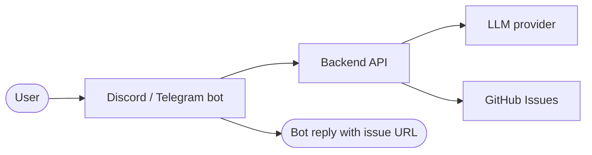

# blurt

**Message your bot. Get a polished GitHub issue back.**

Capture ideas before they disappear. blurt takes a rough message — a shower thought, a half-formed feature idea, a bug you noticed — and turns it into a structured GitHub issue, automatically.

No app to open. No form to fill out. Just send a message.

  

---

## Features

- **Discord + Telegram bots** — send ideas from wherever you already are
- **Multiple LLM providers** — Gemini, OpenAI, Anthropic, or local Ollama
- **Auto-structured output** — title, summary, and tags generated from your raw input
- **GitHub issue creation** — issues land directly in your repo
- **Self-hostable** — runs with a single `docker compose up -d`
- **Minimal friction** — no UI, no accounts, just a bot message

---

## Example

**You send:**
> what if the rocket could like, figure out on its own when to abort the landing burn, based on terrain or whatever, instead of us hardcoding the altitude threshold. some kind of adaptive thing. probably hard idk

**blurt creates:**

- **Title:** `Adaptive landing burn abort trigger based on terrain sensing`
- **Summary:** Instead of a hardcoded altitude threshold, the landing burn abort logic should dynamically adjust based on real-time terrain data. This would allow the system to respond to uneven or unexpected ground conditions rather than relying on a fixed value.
- **Tags:** `landing`, `autonomy`, `guidance`
- **Issue:** `https://github.com/you/rocketship/issues/42`

---

## How it works

1. Send a rough idea to your Discord or Telegram bot
2. blurt passes it to your configured LLM, which generates a title, summary, and tags
3. A GitHub issue is created in your repo
4. The bot replies with the issue title and link

---

## Getting started

**You'll need:**
- Docker + Docker Compose
- A GitHub repo and a [personal access token](https://github.com/settings/tokens) with Issues write permission
- An LLM API key — Gemini recommended ([free tier available](https://aistudio.google.com/app/apikey))
- A Discord bot token ([Discord Developer Portal](https://discord.com/developers/applications)) or a Telegram bot token ([@BotFather](https://t.me/botfather))

**Run the quickstart:**

```bash
curl -fsSL https://raw.githubusercontent.com/sholgaat/blurt/main/quickstart.sh -o /tmp/blurt-setup.sh && bash /tmp/blurt-setup.sh
```

The script collects your credentials and tells you when to run `docker compose up -d`.

**Prefer to inspect first:**

```bash
curl -fsSL https://raw.githubusercontent.com/sholgaat/blurt/main/quickstart.sh -o blurt-setup.sh
# read blurt-setup.sh
bash blurt-setup.sh
```

---

## Architecture



---

## Advanced

### Use a local LLM with Ollama

1. Start Ollama alongside the stack:

```bash
docker compose -f docker-compose.yml -f docker-compose.ollama.yml up -d
docker compose exec ollama ollama pull phi3:mini
```

2. Run the quickstart and select Ollama as your LLM provider when prompted.

Model data is persisted in the `ollama-data` volume across restarts.

### Build images from source

By default, Docker pulls pre-built images. To build locally instead, before running `docker compose up -d`:

```bash
mv docker-compose.override.yml.disabled docker-compose.override.yml
```
