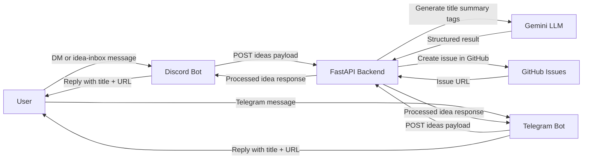

```mermaid
flowchart LR
    U[User]
    DB[Discord Bot]
    TB[Telegram Bot]
    B[FastAPI Backend]
    LLM[Gemini LLM]
    GH[GitHub Issues]

    U -->|DM or idea-inbox message| DB
    U -->|Telegram message| TB

    DB -->|POST ideas payload| B
    TB -->|POST ideas payload| B

    B -->|Generate title summary tags| LLM
    LLM -->|Structured result| B

    B -->|Create issue in GitHub| GH
    GH -->|Issue URL| B

    B -->|Processed idea response| DB
    B -->|Processed idea response| TB

    DB -->|Reply with title + URL| U
    TB -->|Reply with title + URL| U
```
